拖拽（drag&drop）并不是最常见的一种交互方式，这受制于应用场景，也受制于开发成本。不过，拖拽可以说是最**自然**的交互方式之一。

与鼠标的双击（double-click）、右击（right-click）这种专为计算机发明的操作相比，拖拽更广泛地存在于我们的日常生活中——当你整理桌面时、当你从书架中抽出一本书时、当你将需要的会议文件理好顺序时——这些任务都可以看作是“拖拽”交互的原型。

## 一、拖拽的场景

拖拽交互出现的场景主要有以下4个，有时这些场景可以同时出现。

### 1、调整位置

允许用户对元素进行随意的布局和摆放。

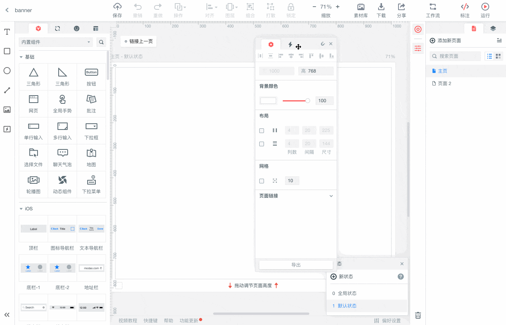

墨刀-自由调整面板位置

### 2、排序

在单一方向，对列表中的内容进行排序。

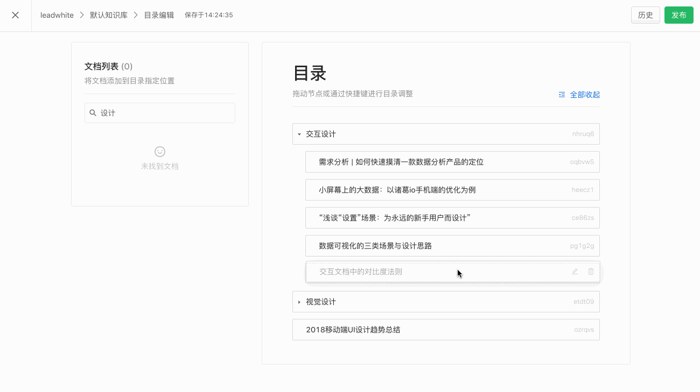

语雀文档目录-拖拽排序

### 3、收纳

最典型的拖拽收纳是将文件放入文件夹中。

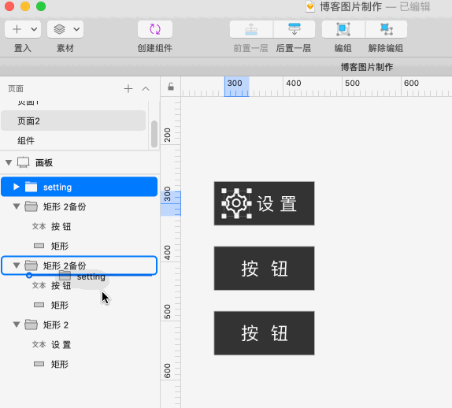

sketch-将元素拖拽进文件夹里

拖拽上传也可看作是“收纳”场景的一种变体，用户将文件拖入指定区域，可以触发上传操作：

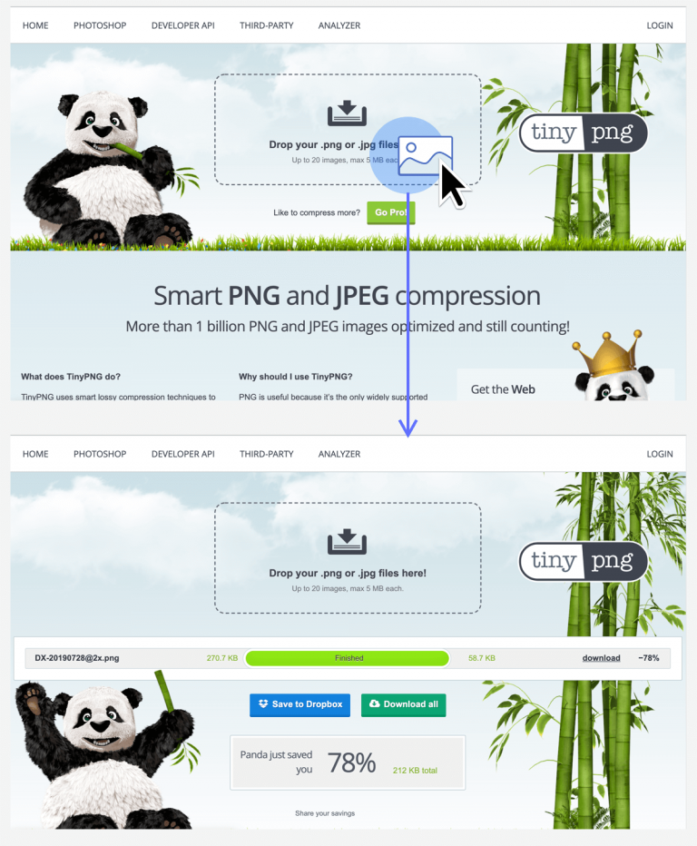

TinyPNG-拖拽上传

### 4、取出

从系统提供的一系列选择中，取出需要的项。

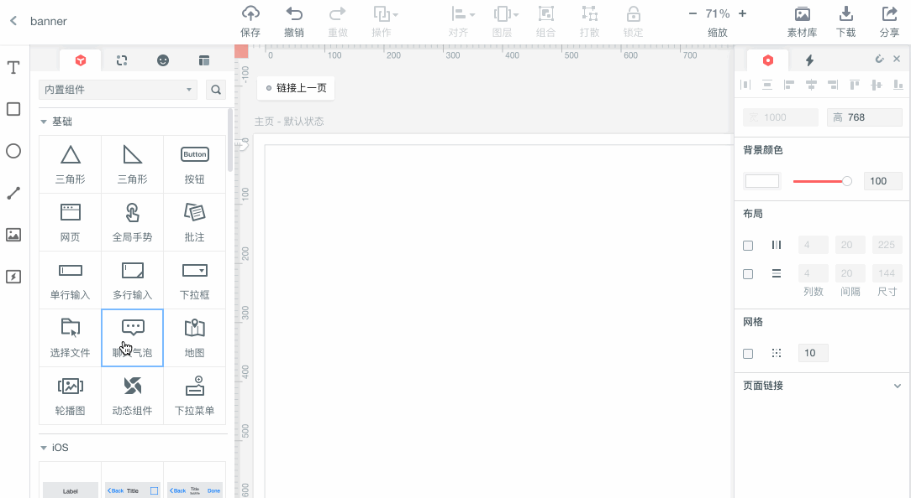

墨刀-使用内置组件

### 5、调整可视范围

最后是对整个页面或画布进行拖动，即调整当前的可视范围。

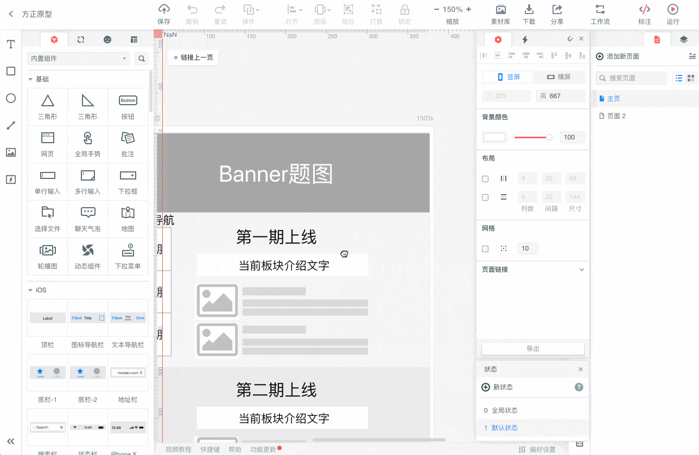

墨刀-拖拽画布

## 二、拖拽前：“你看起来想被我拖拽“

研究拖拽交互的设计要点，我们需要从拖拽前——也就是“如何让用户识别出可拖拽元素”开始。

### 1、光标（Cursor）

在Web平台，几乎所有的可拖拽元素，都需要在hover和拖拽时采用特殊的光标样式。（操作系统和软件中则没有这个要求。）

Mozilla开发者社区（MDN）提供的css开发指南罗列了所有与拖拽交互相关的光标样式。其中，最常被使用的还是move与grab/grabing了。

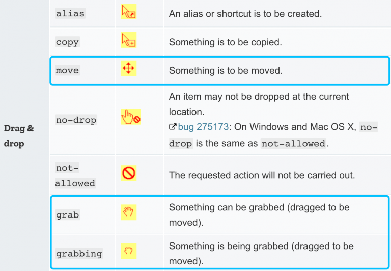

拖拽的光标样式

在大多数场合下，这两种光标是被混用的，都能表示“元素可被拖动”的含义。例如，同样是地图应用，Google地图在拖动整个画布时会显示move光标，而百度地图则显示为grabbing。这种差异似乎并不会给用户带来任何认知上的困扰。

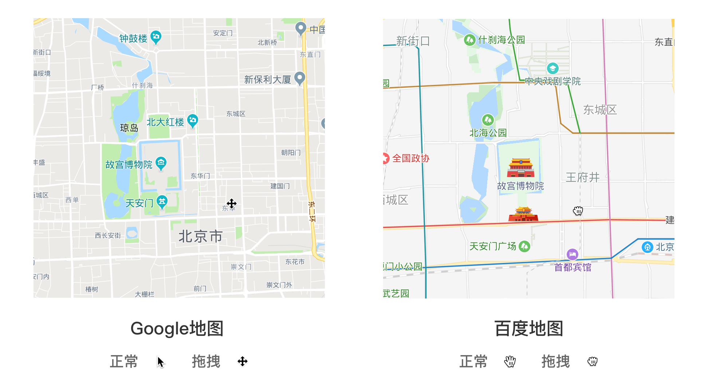

两种表示拖拽的光标

那么，这两个控件具体有没有区别呢？目前为止没有权威性的资料对这两种光标的应用范围进行区分，但通过对多种案例的分析，我们仍能总结出一些差异点：

（1）grab/grabbing光标，提供了“hover时”与“拖拽中“两种样式，在交互方式上更加丰富活泼，也能让用户更好地感知状态的变化；而move光标就相对单一一些。

（2）move象征的是纯粹的“位置的移动”，而grab/grabbing则可以涵盖“拖拽到指定区域以执行操作“的场景。

“网易有数”是一款可视化的数据分析产品，其中包含不少需要进行“拖拽”的场景。我们就以它为例，看看move和grab/grabbing分别适用于什么场景吧。首先观察一下网易有数的页面结构，页面左侧为报表画布，用户可以将制作好的图表进行随意的布局和组合；右侧为图表编辑区，将“纬度”和“度量”中的字段拖拽到“x轴”与”y轴“当中，即可生成所需的报表。

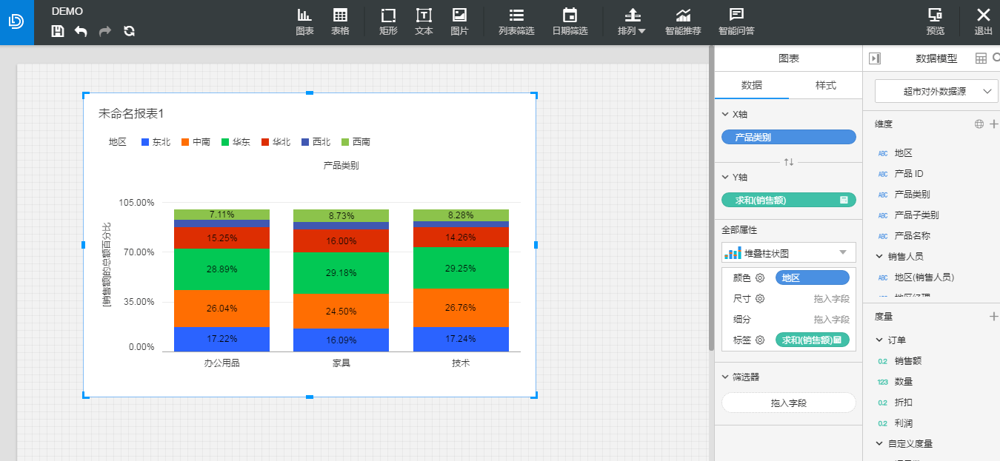

网易有数-创建报告页

可以发现，在左侧的报告画布中，用户移动图表时光标为move；而在右侧边栏中，拖拽字段构建图表则采用了drag光标。这与“move象征位置移动，grab/grabbing代表通过拖拽来执行操作“的结论是吻合的。

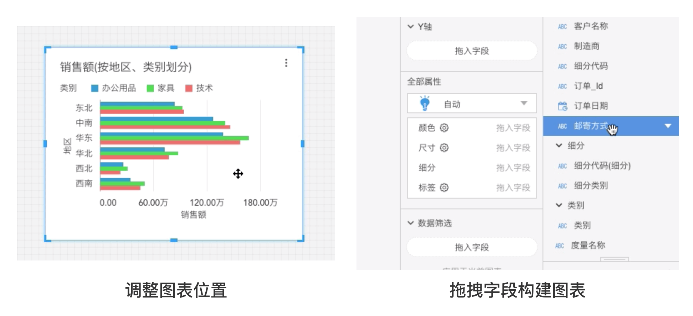

网易有数-两种拖拽光标

（3）在浏览器兼容性和前端开发成本上，move光标远优于grab/grabbing。下图展示了两种光标在各浏览器中的最低兼容版本。可以看出，move能够兼容更低版本的浏览器；而garb/grabbing不仅对浏览器的要求更高，甚至在IE中根本无法实现。

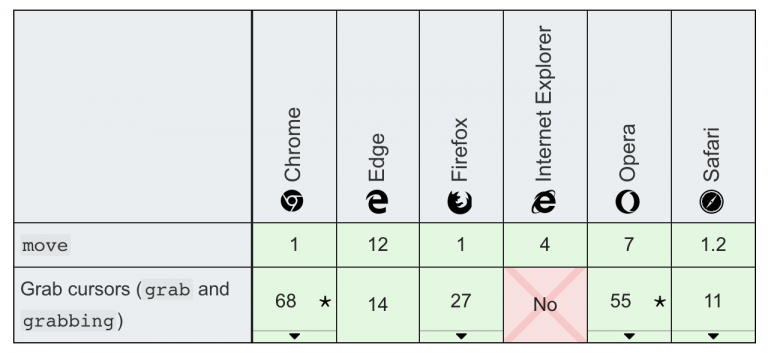

光标的浏览器兼容性

### 2、拖拽icon

一般来说，用户看到“画布”类型的页面，一般都能意识到画布中的元素是可拖拽的。但对于“列表”这类稳定的结构，“可拖拽”就不是那么容易被发觉了。为了解决这个问题，不少产品给可拖拽的卡片与行列添加了“拖拽icon”。

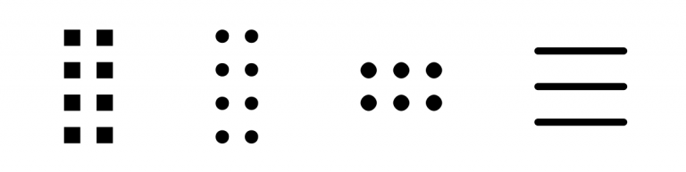

常见的拖拽icon

这个神秘的icon出处暂不可考，但我怀疑它是对“抽屉把手“的一种隐喻。用户先感知到这个“把手”，然后就能把整个卡片（行列）从平面中抽出来，移动后再插入到适当的位置。

在WordPress的古登堡(Gutenberg)编辑器中，用户输入的每个段落都会生成一个模块，而模块是可以上下拖拽移动的。这个交互方式非常新颖，自然也需要用更明确的视觉样式来提示用户，于是拖拽icon就闪亮登场了：

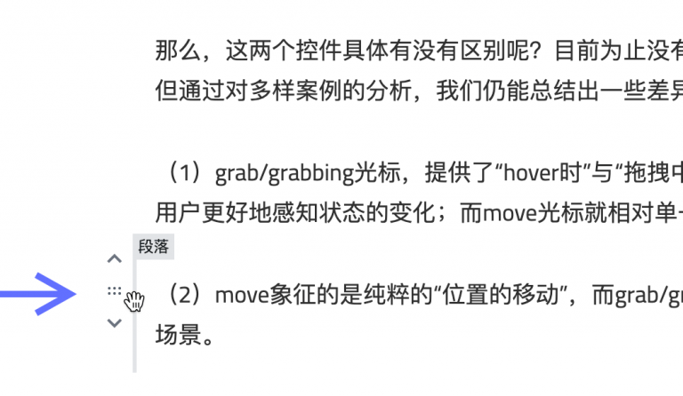

古登堡(Gutenberg)编辑器中的拖拽

在移动端，当拖拽元素不易被发觉、或卡片（行列）只有指定区域可被触发拖拽交互，拖拽icon同样是适用的。

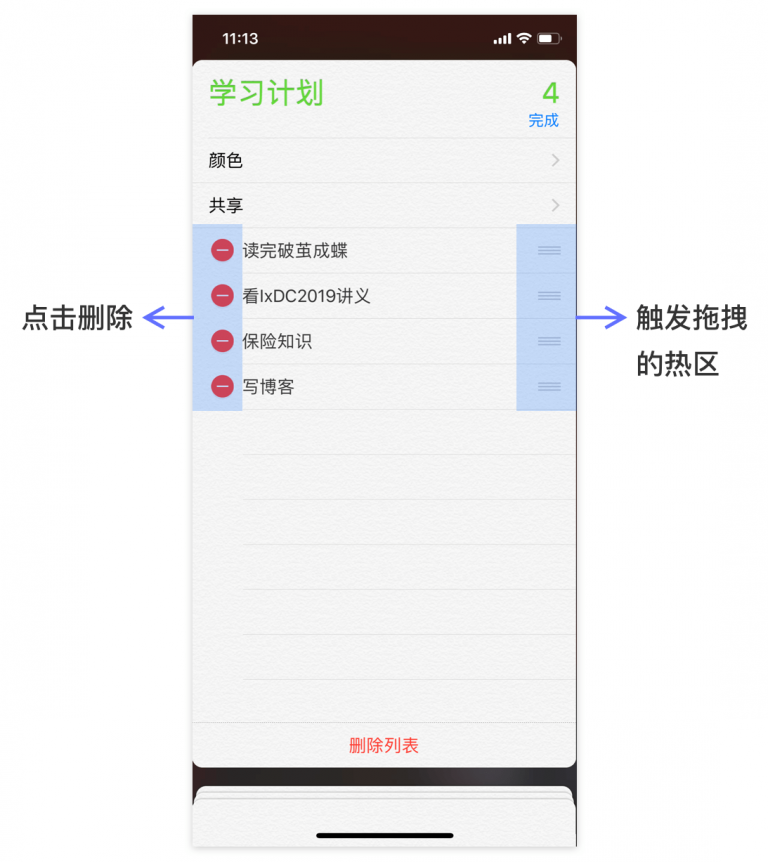

iOS提醒事项-编辑列表

## 三、拖拽中：“准备抛出一块烫手的山芋”

“拖拽中”是一个临时的状态，说到底我们是为了把东西释放（drop）到指定位置才进行拖拽（drag）的。“拖拽中”考虑的事，也是如何把它放下。

在手机系统中调整app的位置，是一个典型的拖拽场景，我们以它为例，来看一下拖拽中的交互细节吧：

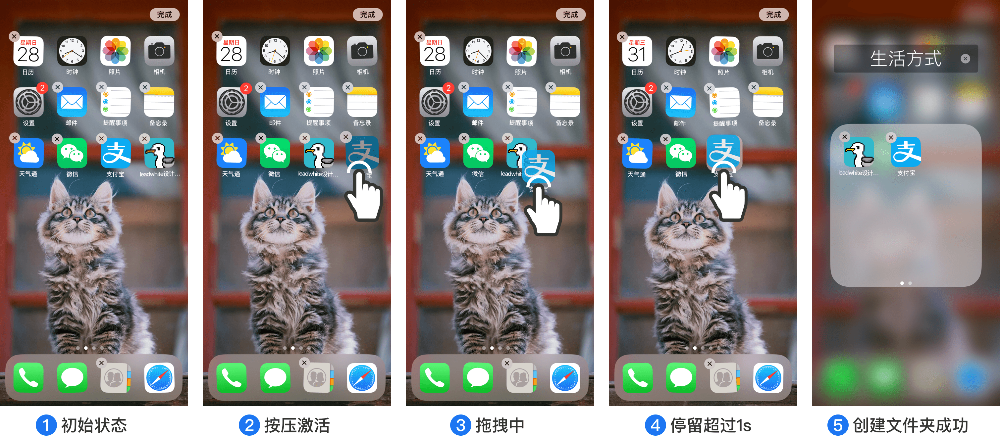

拖拽全流程

### 1、拖拽中的元素

拖拽中的元素，可以采用轻微半透明的视觉样式，体现“临时”状态。

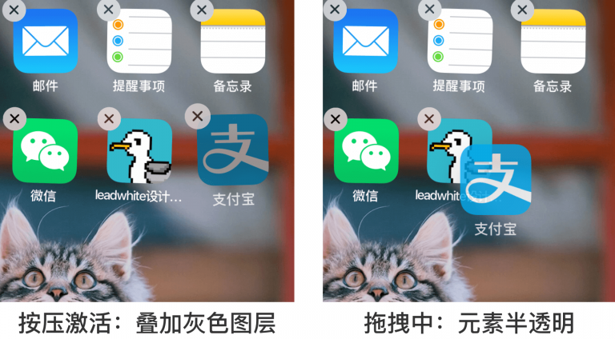

拖拽中的半透明元素

同时，可以给拖拽中的元素增加阴影，以表示“高于主视图”的z轴层级。

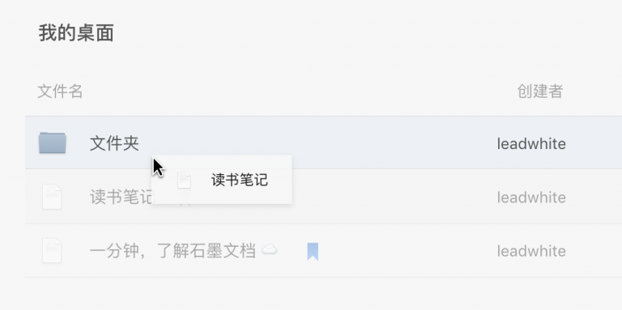

石墨文档-管理文件

### 2、释放区域与预反馈

如果拖拽位置不是完全自由的，而是需要释放到指定区域，那么就需要在视觉样式上进行强调。一方面，我们需要告知用户哪里是可释放的；另一方面，我们需要对用户行为进行“预反馈“，即尚未释放，但已经知道将要发生什么。

一个“预反馈”相当重要的场景，是多级列表。因为可以同时进行“放在下方”与“放入其中”两种操作（它们的判定位置非常靠近），就需要在鼠标未释放时，明确这种差异，告知用户会发生什么：

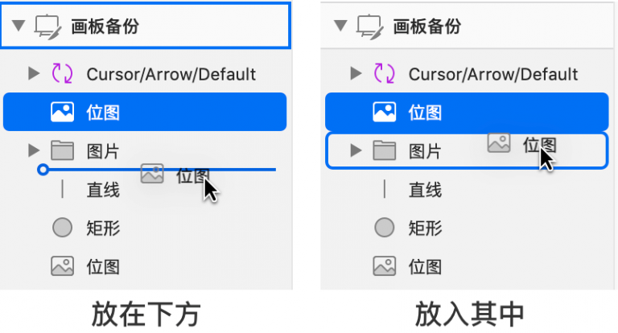

类似的，当我们调整app图标时，如果将拖拽的图标放在另一个app上方，下层的app会出现一圈毛玻璃式的外边框，提醒用户这里将会发生一些变化，这就是一个“预反馈”。如果在这个位置继续停留，下层app会闪烁两次，接着边框扩大为一个浮层，形成一个可以容纳多个app的“文件夹”。

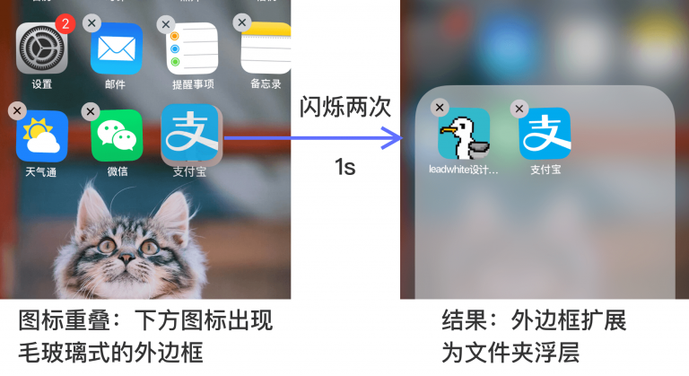

释放区域的微交互

## 四、释放后：“成了！”

释放（drop）后，被拖动的元素就从悬浮状态回归到了平面上。在这个瞬间，我们需要做到的是让“预反馈”落实——给予用户一种确认感。

什么是“确认感”？现在很多经常打字的朋友都喜欢用机械键盘，而机械键盘敲下时的嗒嗒声、键帽弹起时给手指的轻微压力就是“确认感”。它是对我们行为的一种微妙反馈。

例如，在拖动卡片、布局仪表盘的时候，卡片不需要严丝合缝地对齐，只需接近网格的位置，就能进行磁力吸附。这种磁力吸附不仅帮助我们更轻松地完成任务，更是对现实中磁场的模拟，唤醒了我们的触觉体验。

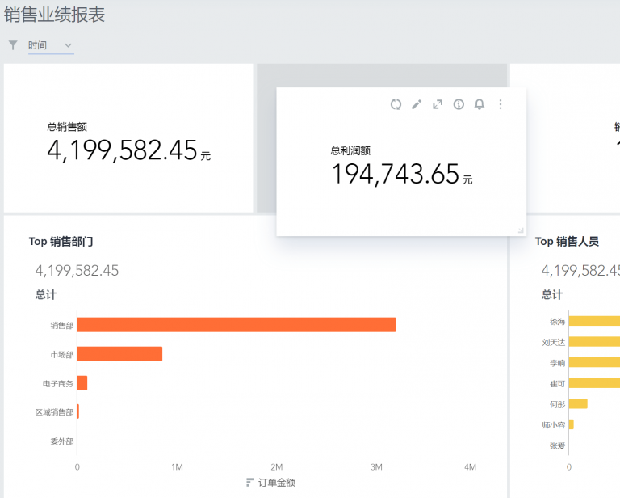

BDP仪表盘

对于系统平台和软件级别的产品，我们甚至能够利用动效与音效，打造更极致的用户体验。在sketch中，用户将参考线拖拽到视图之外，可以删除该参考线。此时，一个“烟消云散”的小动画伴随着轻轻的一声“咚”的删除音效响起， 这种如同“抛开烦恼”的瞬间，是非常愉悦人心的。

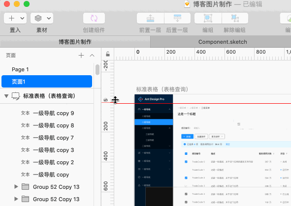

拖拽删除的“确认感”

## 结语

本文总结关于”拖拽交互“的常见场景，并分别对拖拽前、中、后三个阶段做了分析，给出了一些初步的设计方法与建议，希望对大家有所帮助！