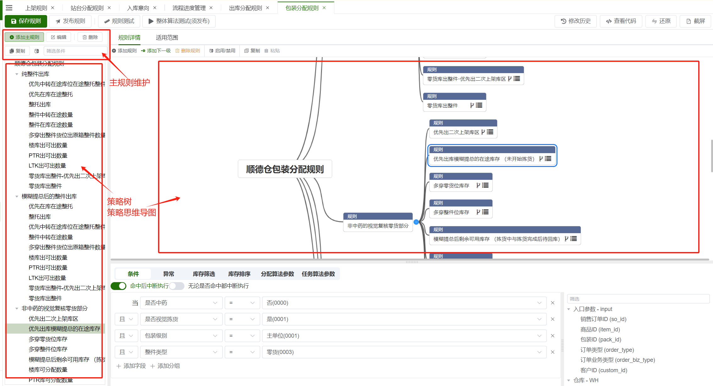
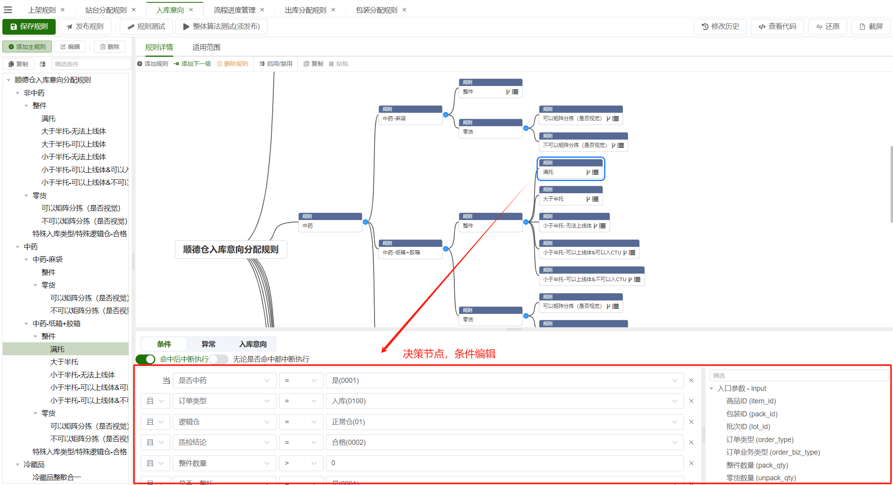

# 介绍
规则引擎，专门用来处理大量逻辑判断，以脑图图形化的方法展现，方便运维和客户使用的一种框架特性

## 添加实体条件
在仓库实体中添加字段条件为例

![[img_1_1.png]]

![[img_1_2.png]]

![[img_1_3.png]]

![[img_1_4.png]]

![[img_1_5.png]]

最后源码需要被重新编译，发布至客户的生产服务器。

![[img_1_6.png]]