开发规则引擎，是以下步骤
## 1.新建规则
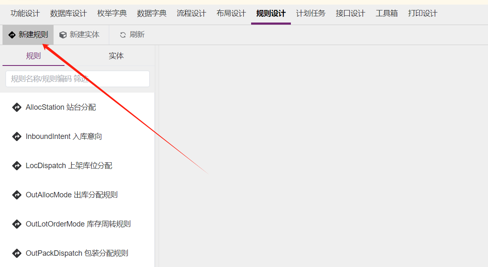

新建的规则
- “规则编码”必须符合标识符特性，不能有空格，不能有特殊字符，不能有中文，必须是字母开头，字母数字下划线组成
- “规则名称”是规则的中文名称，不能有空格，可以有特殊字符，可以有中文

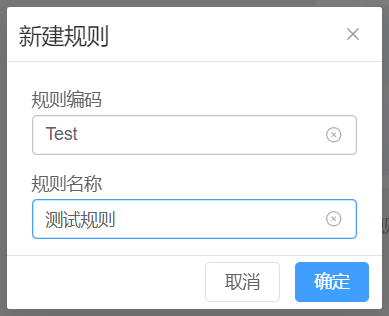

## 2.规则详情
规则必须有
- 算法实现类
- 需要关联事实模型
- 有完整的输入描述
- 有完整的输出描述

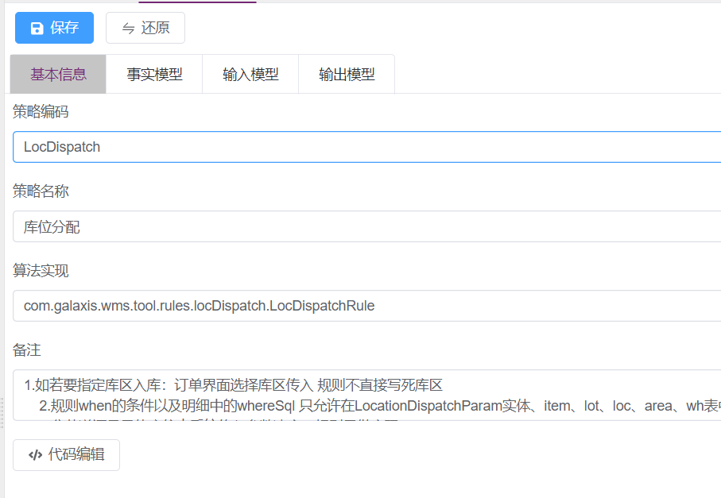
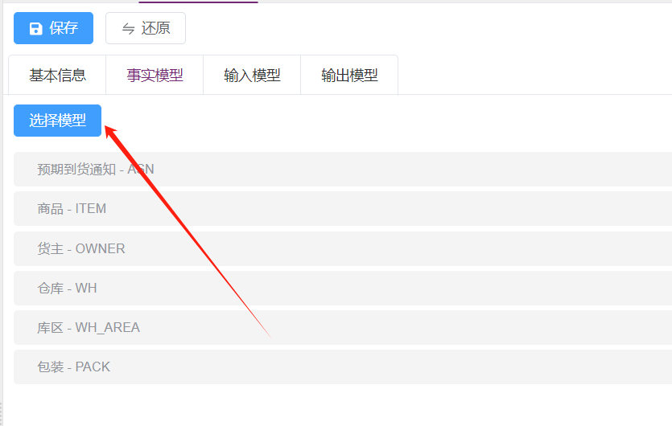
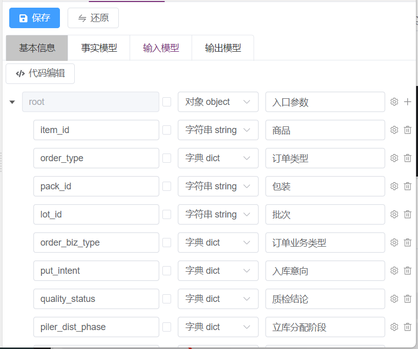
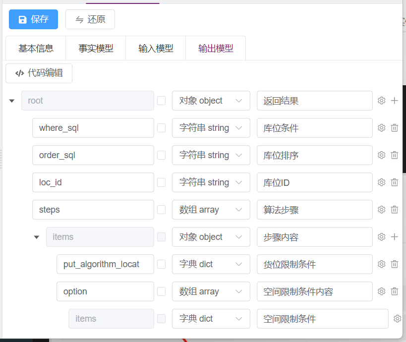

## 3.规则的算法实现
算法类的模板方法是
```groovy
package com.galaxis.wms.tool.rules.locDispatch

import com.galaxis.wms.workbench.RuleFile
import com.yvan.core.BizContext
import com.yvan.core.json.JsonWrapper
import com.yvan.core.mapper.BeanCopyUtils
import com.yvan.rule.Strategy
import groovy.util.logging.Slf4j

@Slf4j
class LocDispatchRule {
    private static final String RULE_CODE = "LocDispatch";
    private static volatile Strategy STRATEGY = null;

    /**
     * 这个方法必须同名保留，规则发生变化时会主动调用这个方法，设置新版本的策略
     */
    public static void setStrategy(Strategy strategy) {
        STRATEGY = strategy
    }

    /**
     * 规则测试方法主体
     * @param params
     * @return
     */
    public static List<Map<String, Object>> testRun(Map<String, Object> params) {
        RuleFile.checkVersion(RULE_CODE, STRATEGY);
        // 检测新版本，并按需加载
        BizContext.setValues(params);
        List<Map<String, Object>> ret = STRATEGY.runList();
        return ret;
    }

    /**
     * 规则调用主体, 方便业务逻辑进行调用
     */
    public static Map<String, Object> run(Map<String, Object> input) {
        RuleFile.checkVersion(RULE_CODE, STRATEGY);
        BizContext.setValues(input);
        List<Map<String, Object>> ret = STRATEGY.runList();
        if (ret.size() <= 0) {
            return null;
        }
        return ret.get(0);
    }
}
```

## 4.编写规则维护的前端模块

### 4.1添加相应的规则维护菜单
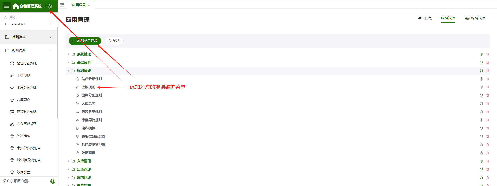
按正常的功能模块方法添加，这里不再赘述

### 4.2进入二开平台，设计规则维护的前端模块
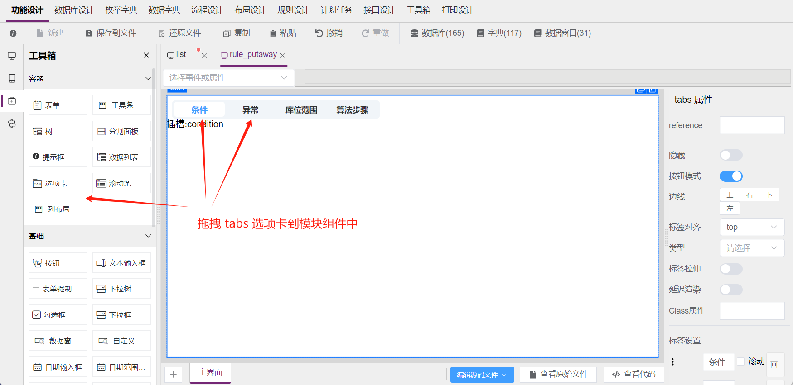

### 4.3固定拖拽 condition 插槽，到条件选项卡
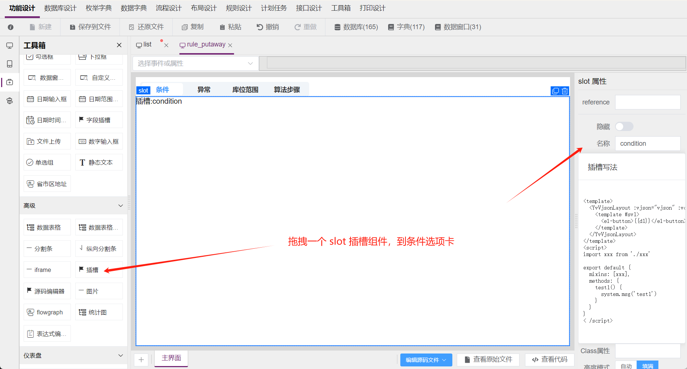

### 4.4固定拖拽 condition 插槽，到“条件”选项卡


### 4.4固定拖拽 exception 插槽，到“异常”选项卡
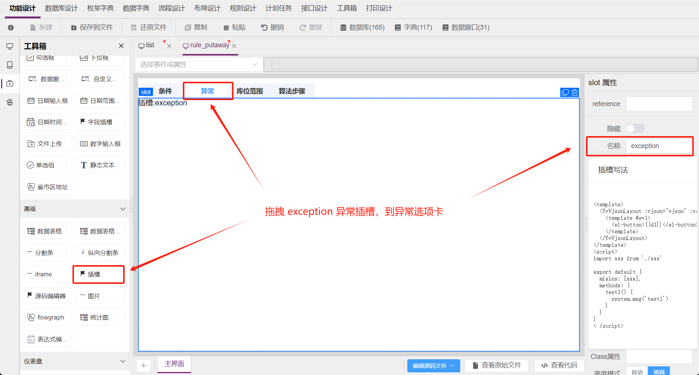

### 4.5 拖拽编辑组件到其他选项卡
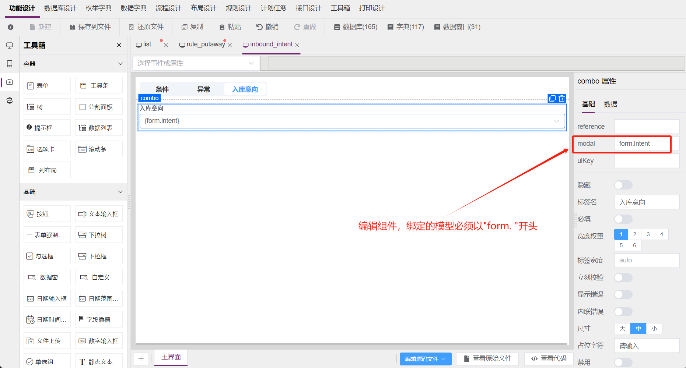
拖拽其他业务决策结果的组件，到自己需要的位置，可以根据需求自行添加
- 绑定的模型名，必须以 "form." 开头
- 比如，规则输出 需要有 is_important / is_urgent 字段
- 那么就需要在 "规则输出" 选项卡，拖拽编辑组件，在 "绑定的模型名" 中填写 "form.is_important"，"form.is_urgent" 等

### 4.6 编辑VUE文件
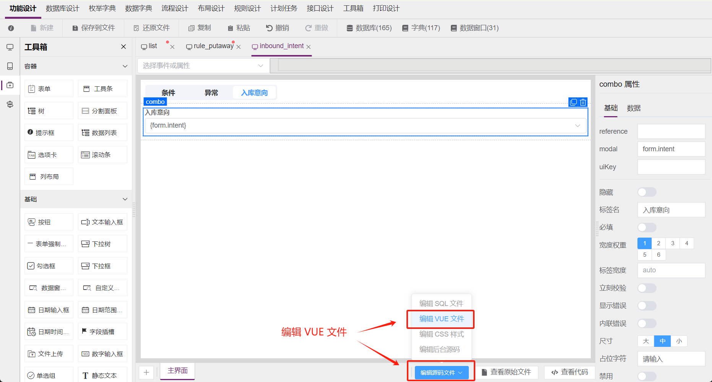

Vue 文件模板如下
```vue
<template>
  <YvRuleEdit ref="ruleEdit" strategyCode="InboundIntent" :editorVjson="vjson" :vcxt="vcxt" :aria-modal="resourceUrl"/>
</template>
<script>
import inbound_intent_design from './inbound_intent.design'

export default {
  mixins: [inbound_intent_design],

  computed: {
    form() {
      return this.$refs.ruleEdit?.currentTreeNodeData?.thenProp
    },
    formId() {
      return this.$refs.ruleEdit?.currentTreeNodeData?.ruleId
    },
  },
  methods: {
  }
}
</script>
```

### 4.7 在运行时打开规则维护

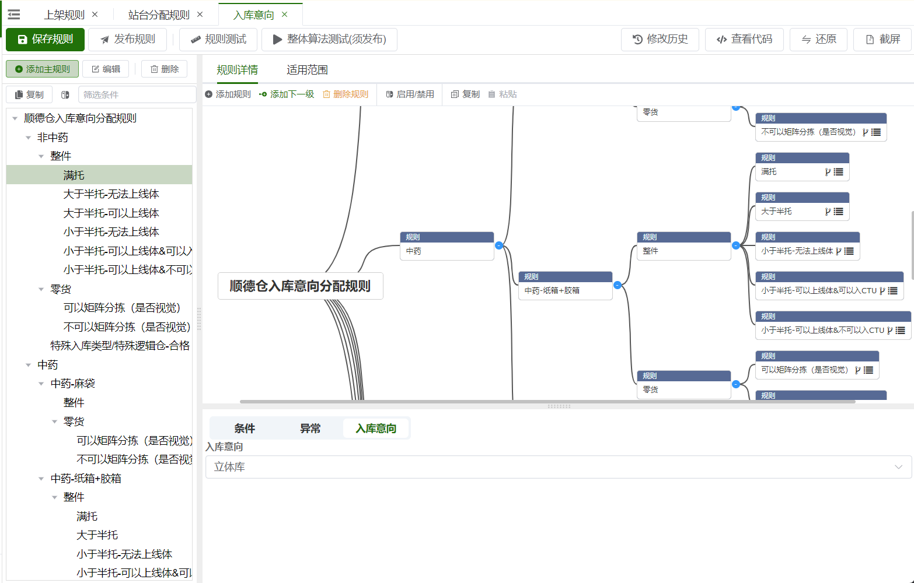
